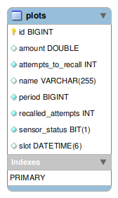

### Automatic Irrigation System Backend
* ### Problem Description:
  As an irrigation system which helps the automatic irrigation of agricultural lands without human intervention, system has to
  be designed to fulfil the requirement of maintaining and configuring the plots of land by the irrigation time slots and the
  amount of water required for each irrigation period.
  The irrigation system should have integration interface with a sensor device to direct letting the sensor irrigate based on
  the configured time slots/amount of water.  <a href="./files/Backend_Full_stack_exercise.pdf">find more details</a>.


* ### Solution:
  The solution provided as:
  * ##### Backend (Spring boot web service)
    - (REST API) End point ```/api/v1/plots```
    - Scheduler to run background job:
      - retrieve plots which their time to be irrigated now or passed with failure.
      - alert job which responsible about sending alert when the irrigating job scheduler failed to recall the sensor configured number of time
    -  Database entities:
    
      
  
    - Find table create sql <a href="./src/main/resources/schema.sql">schema.sql</a>
    - Find data seed <a href="./src/main/resources/data.sql">data.sql</a>

  
  * ##### Frontend (Angular13) <a href="https://github.com/Moustafa-Elgammal/automatic-irrigation-system-frontend">GitHub Repo</a>:
    * One Module which is responsible about calling Backend REST end-point:
      * create new land plot
      * delete plot
      * update (update and configure plot of land)
      * read retrieve plots details

* ### Up & Running:
  * Create database called ```irrgation``` and change the  `application.properties` with your credential.
  * Import the project into your IDE and install the dependencies then Run the mail application.
  * You can find the service in you browser @ <a href="http://localhost:8080">localhost:8080</a>.
  * Check <a href="./postman/irrigation-system.postman_collection.json">Postman Collection</a>.
  * check frontend repo for easy UI to check the system functions.
  * The scheduled jobs can be tracked using the console logs or check <a href="http://localhost:8000/">Scheduler Dashboard</a>.

* ### Learn About the Project:
  * [Building REST services with Spring](https://spring.io/guides/tutorials/rest/) 
  * [Introduction to Spring Data JPA](https://www.baeldung.com/the-persistence-layer-with-spring-data-jpa)
  * [Project Lombok](https://projectlombok.org/)
  * [Introduction to Using Thymeleaf in Spring](https://www.baeldung.com/thymeleaf-in-spring-mvc)
  * [Scheduling Jobs in Spring](https://reflectoring.io/spring-scheduler/) 
  * [Background Jobs in Spring](https://www.baeldung.com/java-jobrunr-spring) 
  * [Testing in Spring boot](https://www.baeldung.com/spring-boot-testing)
  * [Validation in Spring boot](https://spring.io/guides/gs/validating-form-input/)

* ### Future Development:
  * #### Backend enhancements
    * [ ] Secure the end points.
    * [ ] Full Unit tests.
    * [ ] Integration test.
    * [ ] Response Strategies for each status code.
    * [ ] Swagger the end point with postman collection.
    * [ ] Database more entities which help the business.

